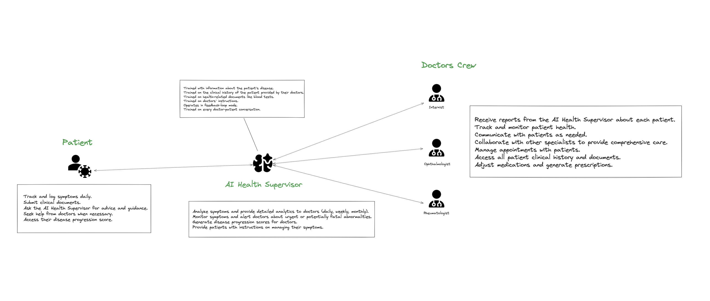

  

<h1 style="font-size: 42px; font-weight:bold" align=center>Remission AI</h1>

<strong>Managing Chronic Diseases with AI Supervision</strong>

  <a href="https://remissionai.com">remissionai.com</a>

 

## Background

I have been diagnosed with two chronic autoimmune diseases: Lupus and Sjogren's Syndrome. This is still new to me, and I'm learning more about my conditions each day. Here is my journey, the things I've learned, and the idea I want to build.

Three months ago, I started noticing unusual muscle cramps all over my body, stomach pain, extreme fatigue, daily fevers, and emotional instability. This might have been triggered by many factors. Last year, I experienced a lot of stress due to multiple product failures, quitting my job, financial issues, and overthinking.

I had health issues every month, such as stomach pain, migraines, tinnitus, light sensitivity, floaters, and a TV-static-like effect in my vision. The fatigue was overwhelming, and to be honest, I wasn't doing much to fix it. I slept too late, didn't eat healthily, worked excessively, and consumed a lot caffeine...

I visited multiple doctors and spent a lot of money, only to be told each time that it was just stress and would go away with lifestyle changes. Then, during Ramadan at home with my family, I experienced my first flare-up. I couldn't move normally; my muscles hurt, I felt fatigued and faint when standing, had nosebleeds, and was mentally depressed—not the same person I was before.

This first flare-up led me to a rheumatologist who checked me, did an X-ray to assess bone health, and found everything normal. After discussing my symptoms, he suspected rheumatoid arthritis, but my RF was negative. However, my ANA (antinuclear antibodies) was 1280, indicating another autoimmune disease. He referred me to an internist specializing in autoimmune diseases. 

The internist conducted a thorough a session, explaining potential problems and checking my overall health, noting my dryness. He ordered additional blood tests like ENA and specific organ tests, as well as a lip biopsy to determine the type of autoimmune diseases. During the waiting period for the results, my symptoms worsened with fever, rashes, extreme fatigue, stomach pain, and muscle pain. I spent most of my time on Reddit, reading about others' experiences, which made my situation even worse.

After a few weeks, I received my results from the lab, confirming I had primary Lupus and secondary Sjogren's Syndrome.

My doctor guided me through the process. After the blood tests, he immediately started me on a remission plan, prescribing high doses (1000mg/day) of corticosteroids at the clinic to induce remission. He monitored my progress closely. After a week of medication, I felt slightly better and had a follow-up checkup. The doctor prescribed the necessary medications and supplements to control the disease activity, which I will have to take for the rest of my life.

There is no cure yet for autoimmune diseases, so the recovery protocol aims to control disease activity, reduce inflammation, take necessary supplements, and keep recurring checks with the doctor while adapting and living with the condition. I now prioritize my health above everything else, determined to fix it or risk suffering for the rest of my life. My mind is constantly thinking about how to use my energy and skills to address this problem.

## Problems

I'm still learning about the disease and don't know everything about it, but here's my research:

### Controlling Disease Activity

#### Protocol
There's no cure yet for autoimmune or chronic diseases in general, and research is still ongoing to understand the root causes. Doctors currently follow a protocol to control and manage the disease's side effects, not the illness itself.

- **Medications to Control Disease Activity:**
  - Hydroxychloroquine: Suppresses the immune system to prevent attacks on organs and body tissues.
  - Corticosteroids: Reduce inflammation and suppress the immune system.
  - Probiotics: For gut health.
  - Long-term use of these medications has many side effects, and doctors often prescribe additional medications and supplements to prevent future complications, such as potassium, calcium, vitamin D, Omega-3, and Royal Jelly.
  - Sun exposure triggers flares, so using sunscreen for UV protection and wearing clothing that covers the body is essential.
  - Other triggers include stress, emotional state, and food.

**Recurring Checkups with My Doctor:**
  - Regular checkups are required where the doctor assesses symptoms and assigns a score that defines disease activity.
  - Doctors prescribe blood tests periodically to check for organ involvement and manage it.
  * Staying active, eating healthy, and reducing stress are essential.
  * Autoimmune diseases often require the collaboration of various specialists because the disease can affect any part of the body.
  * Autoimmune diseases are progressive and get worse over time, so staying alert to new symptoms is crucial.

### Actions I need to take for the rest of my Life

- **Monitoring Symptoms Daily:** I currently use an Excel spreadsheet to track everything, including food intake, symptoms, emotional state, medications, and supplements. This helps me understand what triggers my flares and is useful for my doctor.
- **Recurring Checkups with My Doctor:** Regular checkups are necessary, where the doctor surveys me and adjusts doses, changes medications, prescribes blood tests, etc.
- **Insurance:** I have to take multiple medications daily, and each time I buy a medication, I need to fill out and submit an insurance form, which is a significant mental overhead.
- **Medication Schedule:** I must take medications at specific times each day.
- **Regular Blood Tests:** Every three months, my doctor prescribes blood tests to check organ function and disease activity. Each time, I have to go to the doctor’s office and wait a long time for my appointment.

### Management issues that can be optimized

- **Checkup Time:**
  - **[Slow]** The first two checkups involved a lot of time discussing the disease, conducting biopsies, and organ checks, which took time. Additionally, I spent a long time in the waiting room while feeling unwell.
  - **[Slow]** During my clinic stay, the doctor checked on me daily to monitor treatment progression.
  - **[Medium]** I had to visit twice for analyses like blood tests and doctor evaluations. These checkups were faster but still took time.
  - **[Fast]** After the clinic, the doctor prescribed medications and asked me to return after ten days for a follow-up. This was quicker because we only did the disease activity score test, but the waiting room time was still long.

- **Clinical Management:**
  - The doctor manages multiple patients and keeps clinical history on paper, which is hard to manage. A digital system would help.
  - I have recurring blood tests to do and must deliver them physically to the doctor's office.

## Short-term Goal: Flupus.app
in the short term, my goal is to build the initial version of Flupus to help monitor and control my disease activity. the main objective is to replace my manual process of logging symptoms in an Excel spreadsheet with a simple and automated system. I plan to develop an iOS app that allows easy tracking and logging of symptoms daily through text or voice inputs. This app will connect to iOS HealthKit to provide additional health data such as steps, sleep patterns, and other relevant metrics.

Each day, I will use the app to log my symptoms and relevant health information, The app will include a personal profile feature where I can input details like daily medications, recent blood tests, and other personal health information. An AI supervisor will remind me daily to log my symptoms and perform recurring analyses to provide insights and recommendations. Daily, the AI will analyze my symptoms and emotional/physical state, offering useful tips on managing them. Weekly, it will generate a report summarizing the week's symptoms and providing an analysis. Monthly, the AI will calculate a disease activity score and produce a detailed report, notifying me of any urgent interventions needed.

The app will have a dashboard where I can visualize my disease progression through charts and graphs, helping me understand trends and patterns in my health data. plus, I may include a feature that allows direct communication with the AI supervisor to ask questions and receive personalized advice. The app could also manage my medication schedule, providing reminders for when to take or purchase medications.

The primary outcomes of this short-term goal are to gain better control over my disease activity and to have a more comprehensive understanding of my health. The automated system will help me identify triggers for my flares and give me peace of mind, knowing that I am actively managing my condition. The detailed reports generated by the AI will be useful during my medical checkups, as I will be able to provide my doctor with accurate and comprehensive data.

#### More info: [link ](https://github.com/RemissionAI/Flupus)

## Long-term Vision

### AI Supervision to Manage Chronic Diseases

I am developing a platform designed to manage chronic diseases using AI supervision. The primary goal is to manage disease activity and improve patients' lives. By monitoring symptoms, analyzing data, and generating reports, the platform will provide personalized recommendations and alerts based on individual patient data. This approach will help patients manage their conditions more effectively and improve their quality of life.

Another important goal is to support research. The data collected and analyzed by the AI Health Supervisor will offer valuable insights into disease progression, treatment efficacy, and new management approaches for chronic diseases. This can enhance the understanding of autoimmune diseases and aid in developing new treatments and cures. By monitoring symptoms and providing timely alerts, the AI Health Supervisor can help prevent complications and ensure early intervention, leading to better health outcomes for patients.

The platform also aims to solve several management issues. It will enhance communication between doctors and patients, ensuring timely advice and support, which can improve adherence to treatment plans and overall satisfaction with care. Automating routine tasks such as symptom tracking, data analysis, and report generation will allow doctors to focus more on patient care, leading to more efficient use of healthcare resources. The platform will integrate various aspects of health management, from symptom tracking to medication management and regular checkups, ensuring comprehensive monitoring and management of a patient's health. Additionally, it will enable patients to log symptoms, submit documents, and seek advice from the AI Health Supervisor from their homes, reducing the need for frequent clinic visits and making healthcare more accessible.

### Abstract

### Entities

- **Patients**
  - Track and log symptoms daily.
  - Submit clinical documents.
  - Ask the AI Health Supervisor for advice and guidance.
  - Seek help from doctors when necessary.
  - Access their disease progression score.
- **Benefits:**
  - **Symptom Tracking:** Helps patients understand their condition better and identify potential triggers.
  - **Clinical Document Submission:** Simplify the process of sharing important health documents with healthcare providers.
  - **AI Assistance:** Provides immediate, data-driven advice on managing symptoms and when to seek medical help.
  - **Access to Progression Scores:** Allows patients to monitor their health status and the effectiveness of treatments.

- **AI Health Supervisor**
  - Analyze symptoms and provide detailed analytics to doctors (daily, weekly, monthly).
  - Monitor symptoms and alert doctors about urgent or potentially fatal abnormalities.
  - Generate disease progression scores for doctors.
  - Provide patients with instructions on managing their symptoms.
- **Benefits:**
  - **Symptom Analysis:** Offers precise and timely insights into patient health, aiding early intervention.
  - **Monitoring and Alerts:** Ensures critical symptoms are flagged immediately, preventing complications.
  - **Progression Scores:** Assists doctors in assessing disease progression and adjusting treatments accordingly.
  - **Patient Instructions:** Gives patients with actionable advice, improving self-management of their conditions.

- **Doctors Crew**
  - **Components:**
    - Internist
    - Ophthalmologist
    - Rheumatologist
    - Others...
  - **Responsibilities:**
    - Receive reports from the AI Health Supervisor about each patient.
    - Track and monitor patient health.
    - Communicate with patients as needed.
    - Collaborate with other specialists to provide comprehensive care.
    - Manage appointments with patients.
    - Access all patient clinical history and documents.
    - Adjust medications and generate prescriptions.
  - **Benefits:**
    - **Comprehensive Reports:** Detailed analytics from the AI Health Supervisor facilitate informed decision-making.
    - **Efficient Monitoring:** Continuous tracking helps maintain an up-to-date understanding of patient health.
    - **Improved Communication:** Simplified communication ensures patients receive timely and coordinated care.
    - **Collaborative Care:** Integration with other specialists enhances the overall quality of treatment.
    - **Appointment Management:** Organized scheduling reduces wait times and improves patient experience.
    - **Accessible Records:** Easy access to complete patient histories ensures continuity of care.
    - **Medication Management:** Accurate prescriptions and dosage adjustments help in effectively managing the disease.

### System Flow

1. **Patient Interaction:**
   - Patients log their symptoms, submit clinical documents, and ask for advice from the AI Health

 Supervisor.
   - The AI analyzes the input data, monitors for any urgent issues, and provides feedback and instructions to the patient.

2. **AI Health Supervisor Analysis:**
   - Continuously monitors patient data.
   - Generates detailed reports and disease progression scores.
   - Alerts doctors to any urgent issues.

3. **Doctor's Role:**
   - Review reports from the AI Health Supervisor.
   - Track patient progress and communicate with them as needed.
   - Collaborate with other specialists to ensure comprehensive care.
   - Manage appointments and adjust treatment plans based on up-to-date data.

## The Ultimate Goal
Better understand chronic diseases, provide data for researchers, and help develop cures.

## Motivation
- Survival instincts
- Interesting problem to solve
- Help support research
- Make life better

## Progress
- [**Flupus**](https://github.com/RemissionAI/Flupus): Monitor disease activity app

## Contribution / Funding

If you are interested in this project and want to contribute to solving this problem, or if you see potential investment plans for the long-term vision of the platform, please contact:

    contact@yudax.me

## Licensing
RemissionAI is released under the MIT license.
